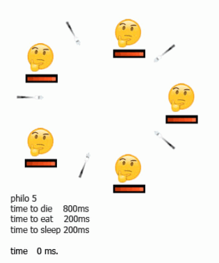

<section class="u-clearfix current-section u-block-f300-1" custom-posts-hash="[]" data-style="blank" data-section-properties="{&quot;margin&quot;:&quot;none&quot;,&quot;stretch&quot;:true}" id="sec-49bf" data-source="Blank" data-id="f300" style="">
  
<h1 class="u-text u-text-default u-block-control u-align-center u-title u-block-f300-8" data-block="29" style="margin: 0px auto; font-size: 3rem;" data-block-type="Text">Philoso​phers</h1><blockquote class="u-text u-text-default u-block-control u-align-center u-block-f300-9" data-block="30" style="margin-top: 0px; margin-bottom: 0px; margin-left: auto; margin-right: auto" data-block-type="Text">project about solving "dinning philosopher problem"</blockquote><h2 class="u-text u-text-default u-block-control u-align-center u-subtitle u-block-f300-10" data-block="31" style="font-size: 1.75rem; margin-top: 1px; margin-left: auto; margin-right: auto; margin-bottom: 0px" data-block-type="Text">Problem statment</h2><ul class="u-text u-text-default u-block-control u-block-f300-11" data-block="32" style="margin-top: 5px; margin-left: 0px; margin-right: 0px; margin-bottom: 0px" data-block-type="Text"><li data-block-type="">

​One or more philosophers sit at a round table. There is a large bowl of spaghetti in the middle of the table.</li><li data-block-type="">

​​The philosophers alternatively eat, think, or sleep.
While they are eating, they are not thinking nor sleeping;
while thinking, they are not eating nor sleeping;
and, of course, while sleeping, they are not eating nor thinking.</li><li data-block-type="">

​There are also forks on the table. There are as many forks as philosophers.</li><li data-block-type="">

&nbsp;Because serving and eating spaghetti with only one fork is very inconvenient, a
philosopher takes their right and their left forks to eat, one in each hand.&nbsp; </li><li data-block-type="">

When a philosopher has finished eating, they put their forks back on the table and
start sleeping. Once awake, they start thinking again. The simulation stops when
a philosopher dies of starvation. </li><li data-block-type="">

Every philosopher needs to eat and should never starve. </li><li data-block-type="">

Philosophers don’t speak with each other. </li><li data-block-type="">

Philosophers don’t know if another philosopher is about to die. </li><li data-block-type="">

No need to say that philosophers should avoid dying!&nbsp; </li></ul>
​The simulation of the life of philosophers will be carried out according to the following rules:
<ul class="u-text u-text-default u-block-control u-block-f300-24" data-block="35" style="margin-top: 4.75px; margin-right: auto; margin-bottom: 0px; margin-left: 0px" data-block-type="Text"><li data-block-type="">

Program will take arguments:</li></ul><ol class="u-text u-text-default u-block-control u-block-f300-26" data-block="36" style="margin-top: 6px; margin-right: auto; margin-bottom: 0px; margin-left: 45px" data-block-type="Text"><li data-block-type="">​number_of_philosophers: The number of philosophers and also the number
of forks.
</li><li>​time_to_die (in milliseconds): If a philosopher didn’t start eating time_to_die
milliseconds since the beginning of their last meal or the beginning of the simulation, they die.
</li><li>​time_to_eat (in milliseconds): The time it takes for a philosopher to eat.
During that time, they will need to hold two forks.
</li><li>time_to_sleep (in milliseconds): The time a philosopher will spend sleeping </li><li>number_of_times_each_philosopher_must_eat (optional argument): If all
philosophers have eaten at least number_of_times_each_philosopher_must_eat
times, the simulation stops. If not specified, the simulation stops when a
philosopher dies.&nbsp; </li></ol>
&nbsp; &nbsp; &nbsp; &nbsp;&nbsp;
<ul class="u-text u-text-default u-block-control u-block-f300-27" data-block="37" style="margin-top: 0px; margin-bottom: 0px; margin-left: 0px; margin-right: 0px" data-block-type="Text"><li data-block-type="">Each philosopher has a number ranging from 1 to number_of_philosophers. </li><li data-block-type="">

​Philosopher number 1 sits next to philosopher number number_of_philosophers.
Any other philosopher number N sits between philosopher number N - 1 and philosopher number N + 1.</li><li data-block-type="">

Each philosopher is a thread.</li><li data-block-type="">

Each fork is a mutex.</li></ul>
​The spe​cific rules ​for ​the bonus part are:

<ul class="u-text u-text-default u-block-control u-block-f300-4" data-block="27" style="margin-top: 0px; margin-right: auto; margin-bottom: -0.25px; margin-left: 0px" data-block-type="Text"><li data-block-type="">

​All the forks are put in the middle of the table. That means that any philosopher can take any fork to eat.</li><li>

​ They have no states in memory but the number of available forks is represented by
a semaphore.</li><li>

​Each philosopher should be a process. But the main process should not be a
philosopher.
</li></ul>

</section>

### There is some animation explanation:

### Mandatory part using treads per philo and mutexes per fork
#### odd number of philosophers case

#### even number of philosophers case

### Bonus part using processes per philo and semaphore as forks
#### odd number of philosophers case
